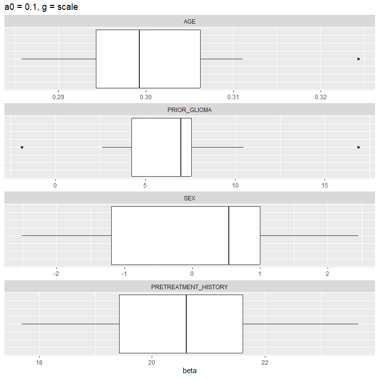
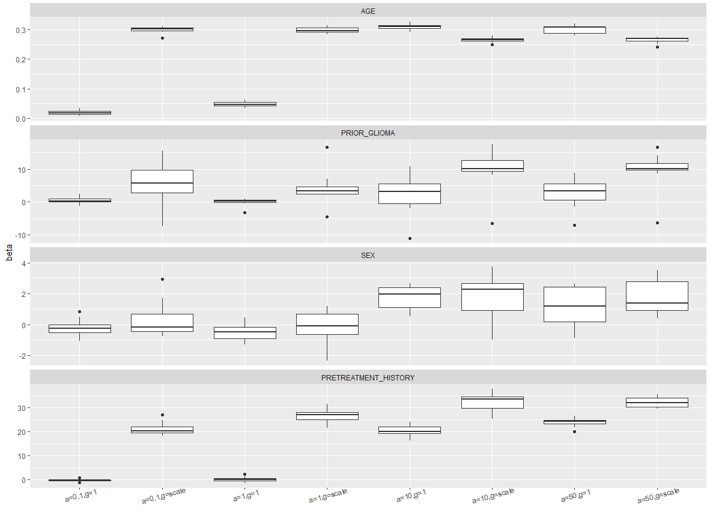

# BayesMultiomics
 BayesMultiomics is designed for statistical modeling and inference with a two stage Bayesian shrinkage model specially designed for high dimensional multi-platform genomics and health care data. 
  Our R package BayesMultiomics is based on Bayesian shrinkage based data integration model developed by us earlier (Xue et al., 2024). 
  This model can integrate and synthesize data from four different data platforms as a) gene expression, b) DNA Methylation, c) gene functional classification obtained from Database for Annotation, Visualiza-tion, and Integrated Discovery (DAVID) (Sherman et al., 2022; Huang et al., 2009), and d) clinical features and clinical outcomes. 
  Our BayesMultiomics package offers versatility and flexibility by incorporating information across all 4 mentioned platforms to learn the underlying biological mechanisms among different high-throughput platforms. 
  In addition, our package is scalable and can perform high-dimensional variable selection for discovering relationship across platforms and identifying clinically relevant biomarkers.

## Installation
```
remotes::install_github("cmansoo/BayesMultiomics", build_vignettes=TRUE)
```

## Vignettes
```
library(BayesMultiomics)
vignette("BayesMultiomics")
vignette("DAVIDGeneGrouping")
```

## Example Data

The package exports an example data - a Glioblastoma (GBM) dataset. The example gene symbols used are exported in an object `eg_gene_symbols`. 
To obtain gene grouping, we need to get functional classification of the genes using DAVID tool.

## David functional classifcation tool

Please refer to `vignette("gene_grouping")` a detailed guid on using DAVID Functional Classification Tool.

Once the classification file is downloaded as txt, use `DAVIDGeneGrouping()` function to obtain the gene grouping. Replace `fp` with your own file path.

```
fp <- system.file("eg_fx_classification.txt", package="BayesMultiomics") # replace with your own.
gene_grouping <- DAVIDGeneGrouping(eg_gene_symbols, fp)
gene_grouping
```


## 5. First Stage Data Integration Model (FSDIM)

In the first stage, we will combine information from methylation, gene expression, and gene
function annotation data to group genes based on how their expressions are regulated by DNA
methylation.

FSDIM aims to combine information from methylation `M`, gene expression `G`, and gene function annotation data (functional classification) to group genes based on how their expressions are regulated by DNA methylation. Essentially, Essentially, we divide the given K genes into three groups: (1) genes that are modulated by only DNA methylation (M type effect); (2) genes that are modulated by aspects other than DNA methylation (M¯ type effect); (3) genes that are modulated jointly by DNA methylation and aspects other than DNA methylation.Genes will be assigned group membership depending on the coefficient of determination, R2 of FSDIM.

The functional classification used in FDSIM is obtained from Database for Annotation, Visualization, and Integrated Discovery ([DAVID](https://david.ncifcrf.gov)). 

(example code on how to use `FSDIM`)
```
# example data
M <- GBM_data2$M
G <- GBM_data2$G

FSDIM_result <- FSDIM(M, G, gene_grouping, I=10, thresh=0.001)
```

## Second Stage Data Integration Model (SSDIM)

SSDIM is a linear model that can be used to detect biomarkers associated with the clinical outcome `Y` of interest while considering the knowledge learned from FSDIM. It regresses clinical outcome of interest on relevant clinical features `C` and gene expression `G`, regularized with a group penalty reflecting methylation regulating mechanism and gene functional similarity learned from FSDIM. In this way, the SSDIM further integrates clinical outcomes to develop a unified way of combining and curating the set of predictor variables with the clinical responses.

(example code on how to use `NEG_em`, may change as necessary)
```
G <- GBM_data2$G
Y <- GBM_data2$Y
C <- GBM_data2$C
R2 <- FSDIM_result$R2
Zmatrix <- Zmat_builder(R2, G, 0.2, 0.8)
mpmath <- setup_mpmath()
a <- 0.1
g <- "scale"

SSDIM_result <- SSDIM(Y, G, C, a0=a, gstr=g, Zmatrix,
                      I=10, thresh=0.001, .mpmath=mpmath)
```

## Data Analysis with `Bayesmultiomics`

`BayesMultiomics` function puts together the first and second stage models and performs the entire algorithm. The output summarizes 1) selected genes from the first stages modeling, 2) gene functional classificaiton groups and methylation groups; 3) coefficients of the clinical features and selected genes. `BayesMultiomics.CV` is an extended version `BayesMultiomics` where the performance of models are evaluated using K-fold cross validation. `BayesMultiomicsPriorSensitivity` function performs the same tasks over a range of values of priors `a` and `g`. 

### Example with `BayesMultiomics`
```
M <- GBM_data2$M
G <- GBM_data2$G
fp <- system.file("eg_fx_classification.txt", package="BayesMultiomics") # replace with your own
gene_grouping <- DAVIDGeneGrouping(eg_gene_symbols, fp)
Y <- GBM_data2$Y
C <- GBM_data2$C
a <- 0.1
g <- "scale"
mpmath <- setup_mpmath()

# run
multiomics <- BayesMultiomics(
  M=M,
  G=G,
  grouping=gene_grouping,
  Y=Y,
  C=C,
  a0=a,
  gstr=g,
  EMVS_I = 10,
  NEG_I= 10,
  EMVS_thresh = 0.0001,
  NEG_thresh = 0.0001,
  transform_M = "L",
  lower_R2 = 0.2,
  upper_R2 = 0.8,
  .mpmath = mpmath
)

# summaries
print(multiomics)
#> $Genes
#>   gene_name   coeff methylation_group functional_group
#> 1    SEMA3E -1.6257                 M               30
#> 2   RANBP17  3.6941             joint               30
#> 3       IL8 -2.9560                 M               30
#> 4      CBR1 -7.3808              nonM               30
#> 5     DDIT4  5.8269              nonM               30
#> 6    HAPLN1  2.8052                 M               22
#> 
#> $`Clinical Variables`
#>      clinical_variable   coeff
#> 1                  AGE  0.3007
#> 2         PRIOR_GLIOMA  9.9836
#> 3                  SEX  0.2674
#> 4 PRETREATMENT_HISTORY 19.1486
```


### Example on `BayesMultiomics.CV`
```
M <- GBM_data2$M
G <- GBM_data2$G
fp <- system.file("eg_fx_classification.txt", package="BayesMultiomics") # replace with your own file path
gene_grouping <- DAVIDGeneGrouping(eg_gene_symbols, fp)
Y <- GBM_data2$Y
C <- GBM_data2$C
a <- 0.1
g <- "scale"
Delta <- GBM_data2$Delta

# run
multiomics_cv <- BayesMultiomics.CV(
  M=M,
  G=G,
  grouping=gene_grouping,
  Y=Y,
  C=C,
  a0=a,
  gstr=g,
  Delta=Delta,
  n_fold=10,
  random_seed = 123,
  EMVS_I = 10,
  NEG_I=20,
  EMVS_thresh = 0.0001,
  NEG_thresh = 0.0001
  )

```

```
print(multiomics_cv)
#> $performance
#>                 average of 10-fold
#> prior_a         "0.1"             
#> prior_g         "scale"           
#> n_selected_vars "4.9"             
#> r2_train        "0.4462951"       
#> r2_test         "0.2820807"       
#> cindex_train    "0.603808"        
#> cindex_test     "0.5694689"       
#> mse_train       "241.2258"        
#> mse_test        "358.8711"        
#> 
#> $`Clinical Variables`
#>      clinical_variable   coeff
#> 1                  AGE  0.3008
#> 2         PRIOR_GLIOMA  6.6989
#> 3                  SEX  0.0631
#> 4 PRETREATMENT_HISTORY 20.6203
#> 
#> $Genes
#>   gene_name   coeff methylation_group functional_group
#> 1    SEMA3E -1.1192                 M               30
#> 2   RANBP17  5.1743             joint               30
#> 3       IL8 -1.8387                 M               30
#> 4      CBR1 -3.8227              nonM               30
#> 5    HAPLN1  1.4706                 M               25
#> 6     SNX10 -1.4528             joint               30
#> 7     DDIT4  3.7527              nonM               30
#> 8      PDPN -0.7673             joint               30
#> 9    DIRAS3 -0.4824             joint               22
#> 
#> $cv_result
#>    n_selected_vars  r2_train    r2_test cindex_train cindex_test mse_train
#> 1                5 0.4320693 0.41371673    0.6087229   0.5250000  248.1316
#> 2                3 0.4360452 0.04633844    0.5666530   0.4285714  261.4944
#> 3                5 0.4127150 0.47003507    0.6057602   0.6250000  233.2838
#> 4                6 0.4666244 0.20842122    0.5899835   0.6923077  235.8966
#> 5                6 0.4839175 0.09613401    0.6039862   0.5250000  239.4192
#> 6                5 0.4592874 0.27401182    0.6216578   0.5619048  241.5848
#> 7                3 0.3293188 0.68343850    0.5971193   0.6761905  277.4251
#> 8                6 0.4431479 0.37657057    0.5922563   0.5583333  239.3620
#> 9                5 0.4800851 0.19017666    0.6225697   0.6190476  230.8215
#> 10               5 0.5197401 0.06196417    0.6293706   0.4833333  204.8389
#>    mse_test       AGE PRIOR_GLIOMA        SEX PRETREATMENT_HISTORY fold
#> 1  278.7602 0.2938718     7.616665  1.3452139             19.59371    1
#> 2  346.9975 0.2858229    16.862161  2.4504641             23.65803    2
#> 3  484.1737 0.2877372    10.481938 -0.7593320             22.48769    3
#> 4  367.5336 0.2997889     7.407864  1.0566537             21.57767    4
#> 5  324.5759 0.3243021     7.285327 -2.5158433             17.68860    5
#> 6  261.0021 0.3069034    -1.884043  0.8189833             19.75791    6
#> 7  306.6359 0.3042418     3.527519 -1.5072478             21.61446    7
#> 8  321.6885 0.3110779     2.608512 -1.3416118             18.99416    8
#> 9  324.6306 0.2987330     6.395921  0.5751106             19.36355    9
#> 10 572.7125 0.2957311     6.687066  0.5086331             21.46679   10
#> 
#> attr(,"class")
#> [1] "BayesMultiomics.CV"
```

```
plot(multiomics_cv)
```



### Example on `BayesMultiomicsPriorSensitivity`
```
# params
M <- GBM_data2$M
G <- GBM_data2$G
fp <- system.file("eg_fx_classification.txt", package="BayesMultiomics") # replace with your own file path
gene_grouping <- DAVIDGeneGrouping(eg_gene_symbols, fp)
Y <- GBM_data2$Y
C <- GBM_data2$C
Delta <- GBM_data2$Delta

a <- c(0.1, 1, 10, 50)
g <- list("scale", 1)
# run
multiomics_sensitivity <- BayesMultiomicsPriorSensitivity(
  M=M,
  G=G,
  grouping=gene_grouping,
  Y=Y,
  C=C,
  a0_vec=a,
  gstr_vec=g,
  Delta=Delta,
  n_fold=10,
  random_seed = 123,
  EMVS_I = 10,
  NEG_I=20,
  EMVS_thresh = 0.0001,
  NEG_thresh = 0.0001
  )
```
```
# summary
summary(multiomics_sensitivity)
#>   prior_a prior_g n_selected_vars          r2_train            r2_test
#> 1     0.1   scale             4.6         0.4447344          0.2356311
#> 2       1   scale             1.1         0.2991569          0.1990819
#> 3      10   scale               0        0.07660568           0.122488
#> 4      50   scale               0        0.07451221          0.2098255
#> 5     0.1       1           118.9 0.999343717229321 0.0800674836910385
#> 6       1       1           121.6 0.999047150484328 0.0502086799757693
#> 7      10       1            37.3 0.704984112972391    0.2730726927321
#> 8      50       1            20.3 0.541417433237452  0.313521104075804
#>        cindex_train       cindex_test         mse_train         mse_test    AGE
#> 1         0.6039121         0.5511064           239.889         392.0899 0.2997
#> 2         0.5922399         0.5785714          308.6202         378.1863 0.2983
#> 3         0.4563015         0.4386447          425.4618         478.5079 0.2656
#> 4         0.4554439         0.4431534            426.26          460.569 0.2656
#> 5   0.9837261876608 0.569041693600517  0.27915451801225 3013.61670468387 0.0202
#> 6 0.980774979851593 0.545494505494506 0.414820698605696 2870.61906324078 0.0485
#> 7 0.700699992390505 0.567619047619048  130.465342405664 328.955405323725 0.3095
#> 8 0.642882894698054 0.576904761904762  201.074619892514 323.467369569342 0.3015
#>   PRIOR_GLIOMA     SEX PRETREATMENT_HISTORY
#> 1       5.7464  0.3279              21.1407
#> 2       4.1700 -0.1551              26.6346
#> 3       9.6345  1.8045              32.2409
#> 4       9.6390  1.8383              32.1582
#> 5       0.4389 -0.2344              -0.2063
#> 6      -0.0515 -0.4946               0.1087
#> 7       2.2420  1.7201              20.5210
#> 8       2.6215  1.1357              23.8527
```

```
plot(multiomics_sensitivity)
```




### Common Parameters of `BayesMultiomics` and its family

The default values for `nu0`, `nu1`, `lambda`, `a`, `b` were chosen per publication: Veronika Ročková & Edward I. George (2013): EMVS: The EM Approach to Bayesian Variable Selection, Journal of the American Statistical Association.

- `nu0`: default = 0.5, Parameter nu0 for spike-and-slab Gaussian mixture prior on β  
- `nu1`: default = 10^3, Parameter nu0 for spike-and-slab Gaussian mixture prior on β
- `nu`: default = 1, For the prior on σ2, an inverse gamma prior π(σ2∣γ)=IG(ν/2,νλ/2)
- `lambda`: default = 1, For the prior on σ2, an inverse gamma prior π(σ2∣γ)=IG(ν/2,νλ/2)
- `a`: default = 1, Parameter a for the beta prior π(θ)∝ θ^(a−1)(1−θ)^(b−1), a,b>0
- `b`: default = 1, Parameter b for the beta prior π(θ)∝ θ^(a−1)(1−θ)^(b−1), a,b>0
- `EMVS_I`: default = 0, Maximum number of iterations of EMVS. 
- `EMVS_thresh`: default = 1e-04, Threshold for convergence criterion for EMVS
- `transform_M`: default = "L", transformation parameter for methylation matrix M. Options: "L" = linear transformation, "Q" = quadratic transformation; "QS" = cubic spline transformation
- `NEG_I`: default = 10, number of maximum iterations for NEG_em. 
- `NEG_thresh`: default = 1e-04, convergence criterion fpr NEG_em 
- `lower_R2`: default = 0.2, lower limit for R2 threshold for loading matrix Z
- `upper_R2`: default = 0.8, upper limit for R2 threshold for loading matrix Z
- `.mpmath`: default = setup_mpmath(), BayesMultiomics imports the mpmath package from python. This parameter is the pointer to mpmath package. Default: setup_mpmath()


